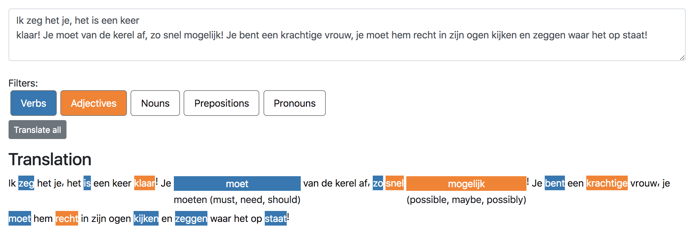

learndutch
==========

Tool for learning Dutch. ([video](https://i.imgur.com/BrTaJtg.gif))

Stack:
 - Docker, Docker Compose
 - ES6
 - Webpack
 - React
 - Redux
 - D3 (for colours)
 - [Frog](http://languagemachines.github.io/frog/) for Dutch NLP
 - Flask microserver for interfacing to the above
 - Glosbe Web API for dutch-to-english word translations
 - [en-pos](https://github.com/finnlp/en-pos) for improving translation accuracy based on matching the English/Dutch POS tags

## Install
 1. `docker-compose -f docker-compose.dev.yml up`
 2. Open [localhost:3000](http://localhost:3000)